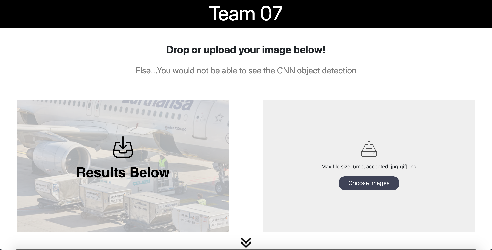
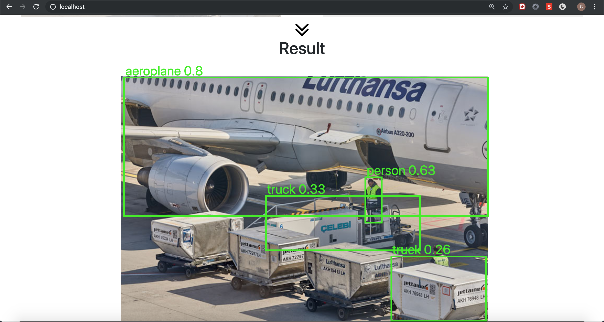
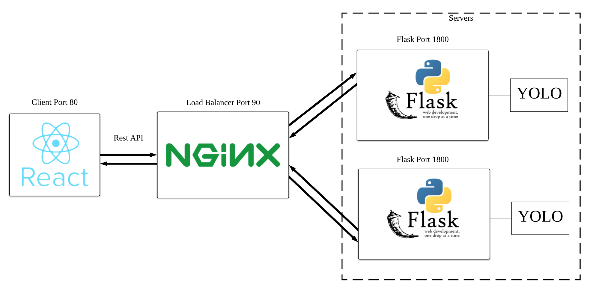

# ICT3102 - Docker Team 7

## :bookmark_tabs:Table of Contents

- [About](#about)
- [System Architecture](#system_architecture)
- [Getting Started](#getting_started)
- [Prerequisites](#prerequisities)
- [Installing](#installing)
- [Built Using](#built_using)
- [Authors](#authors)
- [Acknowledgments](#acknowledgments)

## 🧐  About <a name = "about"></a>

This project allows users to upload an image onto the application and receive a new image with the YOLO image object detection implmented.





## :computer: System Architecture <a name = "system_architecture"></a>



## Getting Started <a name = "getting_started"></a>

These instructions will get you a copy of the project up and running on your local machine for development and testing purposes.

### Prerequisites <a name = "prerequisities"></a>

You will need to have the following installed on your local machine in order for the code to run in your local environment.


| Required | Link                                              |
| -------- | ------------------------------------------------- |
| Docker   | https://www.docker.com/products/docker-desktop    |


### Installation <a name = "installation"></a>

Clone this repository to your desired directory.
```
git clone https://github.com/worhx/ict3102-docker.git
```
Docker

```

docker-compose up

```

## :hammer: Built Using <a name = "built_using"></a>

### [Flask](https://flask.palletsprojects.com/en/1.1.x/) <a name = "flask"></a>
Lightweight 

### [Nginx](https://www.nginx.com/)  <a name = "nginx"></a>
Nginx is a web server which can also be used as a reverse proxy and a load balancer. It allows the request from the client to be properly distributed (round robin) such that the multiple flask services can receive the requests equally. By having multiple flask services, it improves the availability of the application such that in the event of a flask service being down or if it is busy servicing an existing request, the other flask service can still process a new request. Load balancing reduces the stress on a single service and increases the performance of the application.

### [React](https://reactjs.org/) <a name = "react"></a>
ReactJS is one of the best performing frontend framework as it is designed to be a simple and lightweight Javascript Library. One of the advantages of React is the fast rendering which uses virtual DOM through React's [memory reconciliation algorithm](https://reactjs.org/docs/reconciliation.html) as opposed to conventional DOM which is tree structured and small changes at the top layers creates a ripple effect to the interface.  

### [Docker](https://www.docker.com/) <a name = "docker"></a>


## ✍️ Authors <a name = "authors"></a>

- SIT ICT SE - Class of 2021 ICT3102 Team 7


| Student ID & Email | Name & LinkedIn | GitHub |
| -------- | ------------------------------------------------- |--------|
| [1702555](mailto:1702555@sit.singaporetech.edu.sg) | [Cassandra Leong Sok Yee](https://www.linkedin.com/in/cassandra-leong-738317bb)|[cssndrleong](https://github.com/cssndrleong)|  
| [1702673](mailto:1702673@sit.singaporetech.edu.sg) | [Chen Guan Hua](https://www.linkedin.com/in/guanhua-chen-04a420174/) |[Lunchenmeat](https://github.com/Lunchenmeat)
| [1702419](mailto:1702419@sit.singaporetech.edu.sg) | [Ong Xuan](https://www.linkedin.com/in/xuan-ong-50752910a/) |[Xuanong](https://github.com/Xuanong)|  
| [1700512](mailto:1700512@sit.singaporetech.edu.sg) | [Quek Jun Hao](https://www.linkedin.com/in/jun-hao-quek-5455a0175/) |[QJunHao](https://github.com/QJunHao)| 
| [1701591](mailto:1701591@sit.singaporetech.edu.sg) | [Ker Beng Hian](https://www.linkedin.com/in/benghianker/) |[worhx](https://github.com/worhx)
| [1701217](mailto:1701217@sit.singaporetech.edu.sg) | [Tan Qin Xiang](https://www.linkedin.com/in/qin-xiang-tan-19570a113/) |[tqx2012](https://github.com/tqx2012)|

## :man_teacher: Acknowledgments <a name = "acknowledgments"></a>
- Trieu for [darkflow](https://github.com/thtrieu/darkflow.git)
- [Drag & Drop](https://medium.com/@mannycodes/build-a-react-drag-drop-progress-file-uploader-fb874c515a7)
- [Meinheld Gunicorn Flask](https://github.com/tiangolo/meinheld-gunicorn-flask-docker)
- [Draw shape react](https://github.com/ansu5555/draw-shape-reactjs)
